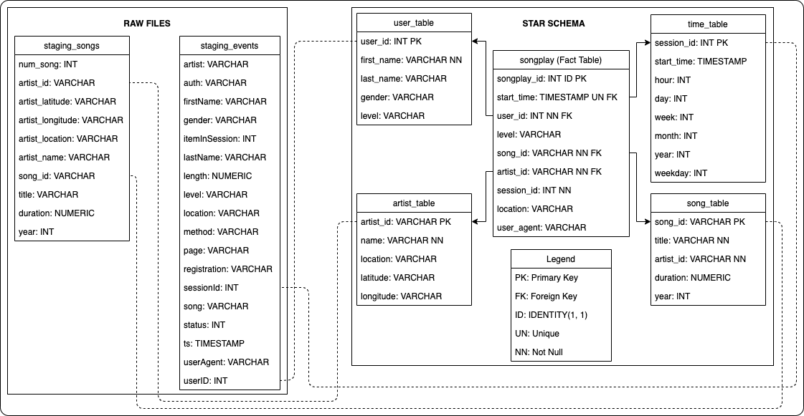

# Project4 - Data Warehouse 
#### A project from Udacity's Data Engineering course
The code was written along the lines of the default Jupyter notebook workspace provided by Udacity.

Author: [Davidson de Faria](https://github.com/davidsondefaria)

## Introduction
The goal of this project is to use Data Warehouse and AWS knowledge to create an ETL pipeline for a Redshift-hosted database.

For this we created tables to receive raw data from S3 and tables in the star schema for data organization. Finally, we execute SQL queries to perform data analysis.

## Code and Data Structure

The data structure is shown in the relationship image below.

[//]: 


The `staging_events` and` staging_songs` tables are used to store raw data, while the `songplay_table`,` user_table`, `song_table`,` artist_table` and `time_table` tables are part of the star schema. The `songplay_table` is the fact table and contains the IDs for the relationship to the dimensional tables.

### Queries
The queries are coded in the `sql_queries.py`. 
- We have queries to drop tables if already exists to ensure that there will be no errors in creating the new tables;
- We have queries to creating tables defining data types and their relationships;
- We have queries to copy raw data from S3 storage to cluster database on Redshift;
- We have queries to get data from staging tables and insert into star schema tables;
- And we have lists of the above queries to automate the execution process.

### Create Tables Process
The code for creating the tables is in the `create_tables.py` file.
We can execute the script using the `python3 create_tables.py` command in a terminal. 
The Create Tables script reads the cluster-hosted database configuration to connect to and create the table schema. Table drop and creation occurs with the following functions:
- `drop_tables(cur, conn)`: Iterate over a list of table drop queries to execute and commit to. Receive parameters to connect to database and connection to data;
- `create_tables(cur, conn)`: Iterate over a list of table create queries to execute and commit to. Receive parameters to connect to database and connection to data.

### ETL Process
The code for extract, transform and load process is in the `etl.py` file.
After execute `create_tables.py`, we can execute this script using the `python3 etl.py` command in a terminal. 
The ETL script connects to Redshift and inserts data from S3 storage into the cluster database. The process is performed through the functions:
- `load_staging_tables(cur, conn)`: Iterate over a list of staging table load queries to execute and commit to. Receive parameters to connect to database and connection to data.
- `insert_tables(cur, conn)`:  Iterate over a list of insert table queries to execute and commit to. Receive parameters to connect to database and connection to data.

### Cluster
The `upCluster.ipnyb` file is a notebook for creating, configuring, and connecting the Redshift cluster. As well as connecting to S3 storage, creating an IAM role for S3 access, connecting to the PostgreSQL database, and deleting the cluster. 
This file was created based on `Exercise 2: Infrastructure as Code` from lesson 2 of chapter 3 of the Udacity Data Engineering course.

### Database
Now we can verify in the Redshift database that the data is entered and perform queries for validation.


## Validation Queries
Next, we have some queries that can be executed directly in Redshift and their results.

1. How many artists are in the bank?
```
    SELECT count(*) FROM artist_table;
```
>**Answer:**
        10025


2. What songs did user 97 listen to? What artist's name? Duration? Sorted by session?
```
    SELECT
        us.first_name,
        sp.session_id,
        sg.title,
        at.name,
        sg.duration
    FROM (SELECT session_id, song_id, user_id 
          FROM songplay_table
         ) AS sp
    JOIN (SELECT user_id, first_name
          FROM user_table
         ) AS us
    ON sp.user_id = us.user_id
    JOIN ((SELECT song_id, title, artist_id, duration 
           FROM song_table
          ) AS sg
          JOIN (SELECT name, artist_id 
                FROM artist_table
               ) AS at
          ON sg.artist_id = at.artist_id
         )
    ON sp.song_id=sg.song_id
    WHERE sp.user_id=97
    ORDER BY sp.session_id;
```
> **Answer:**
> 5 lines of 58

| first_name | session_id | title                                                | name                  | duration |
|------------|------------|------------------------------------------------------|-----------------------|----------|
| Kate       | 147        | Ezio In Florence                                     | Jesper Kyd            | 138      |
| Kate       | 147        | Girlfriend In A Coma                                 | The Smiths            | 123      |
| Kate       | 147        | Ezio In Florence                                     | Jesper Kyd            | 138      |
| Kate       | 147        | Girlfriend In A Coma                                 | The Smiths            | 123      |
| Kate       | 147        | You're The One                                       | Dwight Yoakam         | 239      |

3. Which city is the band 'Foo Fighters'?
```
    SELECT 
        at.location
    FROM (SELECT location, name
          FROM artist_table
         ) AS at
    WHERE at.name='Foo Fighters';
```
> **Answer:**
	 Seattle, WA

4. What's the session with the most songs? What is the user?
```
    SELECT
        sp.session_id,
        us.first_name,
        us.last_name,
        count(*)
    FROM (SELECT session_id, user_id
          FROM songplay_table
         ) AS sp
    JOIN (SELECT user_id, first_name, last_name
          FROM user_table
         ) AS us
    ON sp.user_id = us.user_id
    GROUP BY
        sp.session_id,
        us.first_name,
        us.last_name
    ORDER BY count(*) DESC
    LIMIT 3;
```
> **Answer:**
		
| session_id | first_name | last_name | count |
|------------|------------|-----------|-------|
| 1041       | Chloe      | Cuevas    | 44    |
| 888        | Mohammad   | Rodriguez | 20    |
| 574        | Tegan      | Levine    | 20    |

5. Who listened to the song 'Fade To Black'? How many times? In which sessions? First Name (sorted) and Last Name.
```
    SELECT
        us.first_name,
        us.last_name,
        sp.session_id,
        count(*)
    FROM (SELECT title, song_id
          FROM song_table
         ) AS sg
    JOIN ((SELECT song_id, session_id, user_id
           FROM songplay_table
          ) AS sp
          JOIN (SELECT user_id, first_name, last_name
                FROM user_table
               ) AS us
           ON sp.user_id = us.user_id
         )
    ON sg.song_id = sp.song_id
    WHERE sg.title='Fade To Black'
    GROUP BY
        sp.session_id,
        us.first_name,
        us.last_name
    ORDER BY first_name;
```
>**Answer:**

| first_name | last_name | session_id | count |
|------------|-----------|------------|-------|
| Avery      | Watkins   | 691        | 1     |
| Aiden      | Hess      | 869        | 1     |
| Sienna     | Colon     | 317        | 1     |

6. How many women pay?
```
    SELECT count(*)
    FROM (SELECT gender, level FROM user_table AS us)
    WHERE us.gender='M'
    AND us.level='paid'
```
>**Answer:**
		7

7. TOP 10 most listened songs.
```
    SELECT
        sg.title,
        count(*)
    FROM (SELECT song_id
          FROM songplay_table
         ) AS sp
    JOIN (SELECT song_id, title
          FROM song_table
         ) AS sg
    ON sp.song_id = sg.song_id
    GROUP BY sg.title
    HAVING count(*) > 1
	ORDER BY count(*) DESC
    LIMIT 10;
```
>**Answer:** 

| title                                                | count |
|------------------------------------------------------|-------|
| You're The One                                       | 74    |
| I CAN'T GET STARTED                                  | 18    |
| Catch You Baby (Steve Pitron & Max Sanna Radio Edit) | 18    |
| Nothin' On You [feat. Bruno Mars] (Album Version)    | 16    |
| Hey Daddy (Daddy's Home)                             | 12    |
| Make Her Say                                         | 10    |
| Up Up & Away                                         | 10    |
| Unwell (Album Version)                               | 8     |
| Mr. Jones                                            | 8     |
| Supermassive Black Hole (Album Version)              | 8     |
